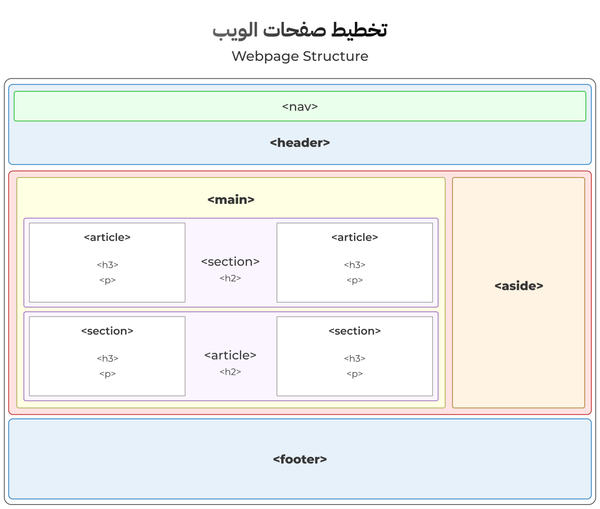

<div dir="rtl">

<h1><code>&lt;body&gt;</code></h1>

يحتوي `<body>` على جميع المحتويات التي يتم عرضها مباشرة للمستخدم، مثل النصوص، الصور، الأزرار، والفيديوهات.

**مثال:**
```html
<body>
    <h1>مرحبًا بكم في صفحة HTML</h1>
    <p>هذه فقرة تعريفية.</p>
    
</body>
```

_لا توجد خصائص مخصصة لوسم `<body>`, ولكن يمكن إضافة الخصائص العامة (Global Attributes)._

---

**العناصر الأساسية في `<body>`**

- [العناصر الهيكلية](#العناصر-الهيكلية)
  - [1. العنصر `<main>`](#1-العنصر-main)
  - [2. العنصر `<header>`](#2-العنصر-header)
  - [3. العنصر `<footer>`](#3-العنصر-footer)
  - [4. العنصر `<aside>`](#4-العنصر-aside)
  - [5. العنصر `<article>`](#5-العنصر-article)
  - [6. العنصر `<section>`](#6-العنصر-section)
- [عناصر النصوص](#عناصر-النصوص)
  - [1. وسم `<p>`](#1-وسم-p)
  - [2. وسوم العناوين `<h1> - <h6>`](#2-وسوم-العناوين-h1---h6)
  - [3. وسم `<span>`](#3-وسم-span)
  - [4. الوسوم `<del>` و `<ins>`](#4-الوسوم-del-و-ins)
    - [4.1 وسم `<del>`](#41-وسم-del)
    - [4.2 وسم `<ins>`](#42-وسم-ins)
  - [5. وسم `<pre>`](#5-وسم-pre)
  - [6. وسم `<code>`](#6-وسم-code)
  - [7. وسم `<mark>`](#7-وسم-mark)
  - [8. وسم `<strong>`](#8-وسم-strong)
  - [9. وسم `<em>`](#9-وسم-em)
  - [10. وسم `<sup>`](#10-وسم-sup)
  - [11. وسم `<sub>`](#11-وسم-sub)
  - [12. وسم `<abbr>`](#12-وسم-abbr)
- [| **`title`** | يُفضل استخدامه ليظهر الكلام بدون اختصار عند التأشير على الكلمة المختصرة. |](#-title--يُفضل-استخدامه-ليظهر-الكلام-بدون-اختصار-عند-التأشير-على-الكلمة-المختصرة-)
  - [13. وسم `<blockquote>`](#13-وسم-blockquote)
  - [14. وسم `<q>`](#14-وسم-q)
- [عناصر القوائم](#عناصر-القوائم)
  - [1. وسم `<ul>`](#1-وسم-ul)
  - [2. وسم `<ol>`](#2-وسم-ol)
  - [3. وسم `<dl>`](#3-وسم-dl)

---

## العناصر الهيكلية



### 1. العنصر `<main>`
يُستخدم لاحتواء المحتوى الفريد والمميز في الصفحة أو المحتوى الأساسي المهم للمستخدم، ويُستخدم مباشرة داخل ال `<body>` وبدون تكرار في الصفحة نفسها.

### 2. العنصر `<header>`
يُستخدم كجزء علوي من الصفحة، يحتوي عادةً على عناصر مثل الشعار، القائمة الرئيسية، وعنوان الموقع.

يمكن استخدامه مباشرة داخل ال `<body>` ليحتوي عنوان الموقع، أو ممكن استخدامه داخل `<article>` أو `<section>` ليحتوي العنوان الخاص بهم.

**مثال:**
```html
<body>
  <header>
      <nav>
          <ul>
              <li><a href="#home">الرئيسية</a></li>
              <li><a href="#about">حول</a></li>
          </ul>
      </nav>
      <h1>عنوان الموقع</h1>
  </header>
</body>
```

### 3. العنصر `<footer>`
يمثل تذييل الصفحة، ويحتوي عادةً على معلومات الاتصال، حقوق النشر، أو روابط أخرى.

**مثال:**
```html
<footer>
  <p>&copy; 2023 - جميع الحقوق محفوظة.</p>
  <a href="contact.html">اتصل بنا</a>
</footer>
```

### 4. العنصر `<aside>`
يستخدم لإظهار محتوى جانبي غير مرتبط بشكل مباشر مع المحتوى الأساسي للصفحة، ولكن يضيف معلومات أو تفاصيل مساعدة، مثل روابط ذات صلة، أو فهرس المقالة.

**مثال:**
```html
<aside>
  <h3>الفهرس</h3>
  <ul>
    <li><a href="#link1">عنوان 1</a></li>
    <li><a href="#link2">عنوان 2</a></li>
  </ul>
</aside>
```

### 5. العنصر `<article>`
يُستخدم لاحتواء محتوى مستقل بذاته؛ بحيث يكون من الممكن أن يفهم المحتوى ويعرض بشكل مستقل. مثل مقالات أو منشورات المدونة.
ولابد من أن يحتوي على عنوان.

**مثال:**
```html
<article>
  <h2>عنوان المقال</h2>
  <p>هذا نص مقال توضيحي يمكن عرضه كجزء من المحتوى.</p>
</article>
```

### 6. العنصر `<section>`
يُستخدم لتقسيم الصفحة إلى أجزاء أو أقسام لتنظيم أجزاء الصفحة. ويجب أن يحتوي على عنوان.

**مثال:**
```html
<section>
  <h2>عن الموقع</h2>
  <p>هذا القسم يحتوي على معلومات حول الموقع والغرض منه.</p>
</section>
```

**روابط للإطلاع أكثر:**
- [HTML5 Structural Elements](https://developer.mozilla.org/en-US/docs/Learn/HTML/Introduction_to_HTML/Document_and_website_structure#Enter_HTML5_structural_elements)

---

## عناصر النصوص

### 1. وسم `<p>`
يُستخدم لكتابة الفقرات النصية داخل الصفحة.
كل فقرة جديدة توضع داخل `<p>...</p>`.

- **مثال:**
    ```html
    <p>نص من فقرة.</p>
    ```

### 2. وسوم العناوين `<h1> - <h6>`
تُستخدم هذه الوسوم من `<h1>` إلى `<h6>` لترتيب العناوين حسب أهميتها، حيث `<h1>` يمثل العنوان الرئيسي للصفحة ويُستخدم لمرة واحدة فقط، بينما تُستخدم `<h2>` إلى `<h6>` للعناوين الفرعية بالترتيب من الأكثر إلى الأقل أهمية.

- **توضيح الاستخدام:**
   - يجب أن تحتوي الصفحة على `<h1>` مرة واحدة فقط.
   - تنظيم الصفحة مهم جداً لظهور الموقع على محركات البحث.
   - لا يُفضّل استخدام `<h3>` إذا لم يحتوي الجزء أو القسم على `<h2>` وهكذا.
  
- **مثال:**
    ```html
    <h1>العنوان الرئيسي للصفحة</h1>
    <h2>العنوان الثانوي</h2>
    <h3>عنوان فرعي</h3>
    ```

### 3. وسم `<span>`
عنصر **inline** غير دلالي يستخدم عند الحاجة لتنسيق جزء من نص بدون إعطائه معنى دلالي.

**مثال:**
```html
<p>هذا هو نص<span style="color:red" >و لكن هذا النص له لون احمر</span> الفقرة.</p>
```

### 4. الوسوم `<del>` و `<ins>`

#### 4.1 وسم `<del>`
يُعتبر اختصارًا لكلمة "deleted"، ويُستخدم لتحديد النص الذي تم حذفه أو شطبه. يظهر النص عادةً بخط مشطوب لتمييزه كجزء من المحتوى الذي قد حُذف. 
يتم استخدام `<del>` غالبًا مع العنصر `<ins>` عندما نرغب في توضيح أن جزءًا من النص قد حُذف واستُبدل بنص آخر.

#### 4.2 وسم `<ins>`
- **وصف:** يُعتبر اختصارًا لكلمة "inserted"، ويُستخدم لتحديد النص الذي تمت إضافته حديثًا إلى المحتوى. يظهر النص عادةً بخط تحت النص لتمييزه.
- **الاستخدام الأمثل:** يُستخدم مع وسم `<del>` لتوضيح أن جزءًا من النص قد تم تحديثه، حيث يُحذف جزء ويُستبدل بآخر جديد.

**من الخصائص (Attributes) الخاصة بوسمي `<del>` و `<ins>`**

| الخاصية        | الوصف                                                                                                   |
| -------------- | ------------------------------------------------------------------------------------------------------- |
| **`cite`**     | يُستخدم لتحديد رابط يوضح مصدر التحديث أو الإضافة، لتوفير معلومات إضافية حول السبب أو المصدر.             |
| **`datetime`** | يُستخدم لتحديد التاريخ والوقت الذي تم فيه التعديل، بصيغة مثل `datetime="2018-05"`، مما يوفر سياقًا زمنيًا. |

- **مثال لاستخدام العنصرين معاً:**
```html
<p>تفاصيل الخدمة:</p>
<p><del cite="previous_version.html" datetime="2023-11-04">توصيل مجاني للطلبات فوق 5000 ريال.</del></p>
<p><ins cite="new_version.html" datetime="2024-11-04">توصيل مجاني للطلبات فوق 3000 ريال.</ins></p>
```

### 5. وسم `<pre>`
اختصار لـ Preformatted. ويُستخدم لإظهار النص كما هو، غالباً يستخدم لإظهار الكود (code snippets).

**مثال:**

> سيتم طباعة الشكل كما هو تماماً دون حذف أي مسافة أو سطر.

```html
<pre>
    ^__^
    (oo)\_______
    (__)\       \\/\
        ||----w |
        ||     ||
</pre>
```

### 6. وسم `<code>`
يعرض النص على أنه كود برمجي. ويستخدم لل **inline** code. وليس كما pre لل code **blocks**، أي يستخدم للكود الذي يكون في نص السطر مع نص عادي.

```html
<p>
لطباعة نص في الجافاسكريبت تستخدم: <code>console.log("some text to print")</code>، حيث ستطبع "some text to print" في ال console.
</p>
```

### 7. وسم `<mark>`
يُستخدم لتسليط الضوء والتعبير عن أهمية جزء من نَص (hilight text) ولكن بشكل مؤقت وليس دائم.

**مثال:**
العرض مؤقت وليس دائم، لهذا استخدم `<mark>`.
```html
<p>جميع العملاء الجدد سيحصلون على <mark>كوبون خصم</mark> على أول عملية شراء.</p>
```

### 8. وسم `<strong>`
يُستخدم لتحديد نص ذو أهمية، وهذا العنصر له معنى دلالي (semantic meaning) ويعني strong emphasis. ويختلف عن العنصر `<b>`، حيث أن العنصر `<b>` يستخدم فقط لغرض التنسيق وليس له معنى دلالي. لهذا لا يُفضل استخدام العنصر `<strong>` لغرض تنسيق النص فقط.

**مثال:**
```html
<p>يعمل <strong>خالد</strong> كمطور ويب في <strong>تكنواي</strong>، حيث يساهم في تطوير حلول تقنية مبتكرة للشركات الناشئة والشركات الكبرى على حد سواء.</p>
```

### 9. وسم `<em>`
سم `<em>`، وهو اختصار لـ Emphasis، يُستخدم لإضافة توكيد أو إبراز نص معين مع معنى دلالي، مثلاً إذا كنت أثناء الحديث غيرت نبرة الصوت للتأكيد على كلمة معينة، عند كتابة هذه الكلمة ضعها في العنصر `<em>`.

يختلف العنصر `<em>` عن الغنصر `<i>` حيث أن العنصر الأخير يستخدم فقط لغرض التنسيق وليس له أي معنى دلالي.

**مثال:**
```html
<p>هذا العنصر <em>ليس</em> للتنسيق</p>
```

### 10. وسم `<sup>`
يستخدم لجعل نص مرتفع قليلاً عن باقي النص، مثلاً يستخدم للقوى (الأسس).

**مثال:**
```html
X = Y<sup>2</sup>
```

### 11. وسم `<sub>`
على عكس العنصر `<sup>` حيث يستخدم `<sub>` لجعل نص منخفض عن مستوى باقي النص مثل العدد الذري للعناصر الكيميائية.

**مثال:**
```html
H<sub>2</sub>O
```

### 12. وسم `<abbr>`
تُستخدم للكلمات المختصرة أو المصطلحات. واستخدامه في هذه الحالات مهم لل accessibility حيث تتعرف ال screen readers عليه.

**مثال:**
```html
<p>لغة <abbr>HTML</abbr> ليست لغة برمجة.</p>
```

**من الخصائص (Attributes) الخاصة بوسم `<abbr>`**

| الخاصية     | الوصف                                                  |
| ----------- | ------------------------------------------------------ |
| **`title`** | يُفضل استخدامه ليظهر الكلام بدون اختصار عند التأشير على الكلمة المختصرة. |
---

### 13. وسم `<blockquote>`
تستخدم للاقتباسات الطويلة، أو التي لا تكون جزء من نص خارج الاقتباسة.

**مثال:**
```html
<blockquote>
    "الحياة مثل ركوب الدراجة. لتحافظ على توازنك، يجب أن تواصل التحرك." - ألبرت أينشتاين
</blockquote>
```
### 14. وسم `<q>`
تستخدم لتحديد الاقتباسات القصيرة ضمن النص. حيث أنه عنصر **inline** على عكس `<blockquote>` الذي يُعتبر عنصر **block**.

**مثال:**
```html
<p>قال ألبرت أينشتاين: <q>الخيال أهم من المعرفة.</q></p>
```

---

## عناصر القوائم

### 1. وسم `<ul>`
اختصار لـ **unordered list** ويُستخدم لإنشاء قائمة غير مرتبة، تعرض العناصر بدون أرقام بشكل افتراضي. ويجب أن يكون العنصر الابن المباشر هو `li`.

**مثال:**
```html
<ul>
    <li>العنصر الأول</li>
    <li>العنصر الثاني</li>
    <li>العنصر الثالث</li>
</ul>
```

### 2. وسم `<ol>`
اختصار لـ **ordered list** ويُستخدم لإنشاء قائمة مرتبة، تعرض العناصر مرقّمة بشكل افتراضي. ويجب أن يكون العنصر الابن المباشر هو `li`.

**مثال:**
```html
<ol>
    <li>العنصر الأول</li>
    <li>العنصر الثاني</li>
    <li>العنصر الثالث</li>
</ol>
```

**إضافة لـ `<ol>` و `<ul>`**
يجب أن يكون العنصر المباشر لكليهما هو `<li>`

فعلى سبيل المثال، الاستخدام بهذه الطريقة خاطئ ❌
حيث يجب أن يكون العنصر الابن المباشر هو `<li>`.
```html
<!-- استخدام `<ol>` أو `<ul>` بهذه الطريقة، خاطئ. -->
<ol>
    <p>العنصر الأول</p>
    <p>العنصر الثاني</p>
    <p>العنصر الثالث</p>
</ol>
```

### 3. وسم `<dl>`
اختصار لـ **description list** ويُستخدم لإنشاء قائمة للمصطلحات.
ويحتوي على العنصرين `<dt>` و `<dd>`.
- يحتوي `<dt>`:  على المصطلح (الكلمة التي تريد شرحها).
- يحتوي `<dd>`:  على الشرح أو التفسير المتعلق بهذا المصطلح.

**ملاحظات:**

- بما أن العنصر `<dt>` عنصر **inline** فيجب أن يحتوي فقط على عناصر **inline**.
- بينما العكس مع `<dd>` حيث يحتوي على عناصر **block** لأنه **block**.
- من الممكن أن يكون الابن المباشر لـ `<dl>` عبارة عن `<div>` اي أنه ليس شرط أن يكون `<dt>` أو `<dd>`.

**مثال:**
```html
<dl>
    <dt>HTML</dt>
    <dd>هي لغة markup.</dd>
    <dt>CSS</dt>
    <dd>لغة تنسيق المواقع.</dd>

    <!-- من الممكن أن يمتلك أكثر من مصطلح، وصف واحد -->
    <dt>Jest</dt>
    <dt>Vitest</dt>
    <dd>أدوات ومكاتب لعمل (تستنج) في الجافاسكريبت</dd>

    <!-- من الممكن أيضاً أن يمتلك مصطلح واحد، أكثر من وصف  -->
    <dt>Javascript</dt>
    <dd>تستخدم لبناء تطبيقات ومواقع الويب.</dd>
    <dd>تستخدم لبناء تطبيقات الموبايل .</dd>
    <dd>تستخدم لبناء تطبيقات الديسكتوب .</dd>
</dl>
```

**مثال ل `<div>` كابن مباشر:**
```html
<dl>
    <div>
      <dt>HTML</dt>
        <dd>لغة ترميز النصوص الهيكلية للمواقع.</dd>
    </div>
    <div>
        <dt>CSS</dt>
        <dd>لغة تنسيق تصميم المواقع.</dd>
    </div>
</dl>
```

</div>